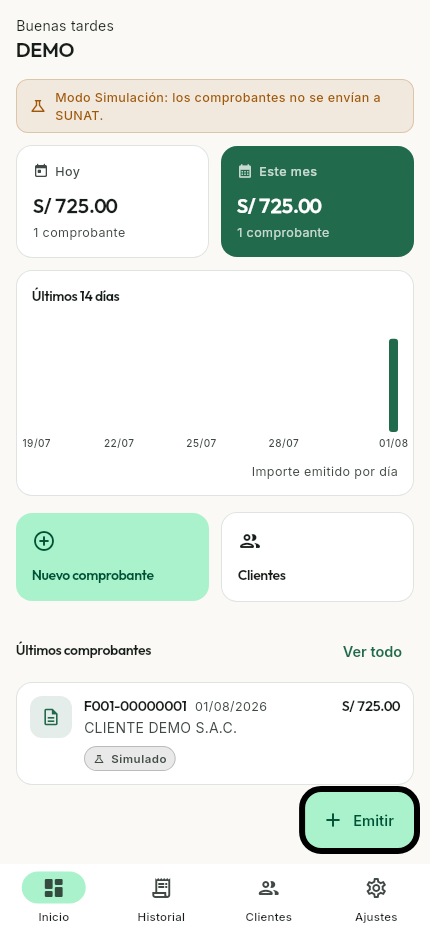
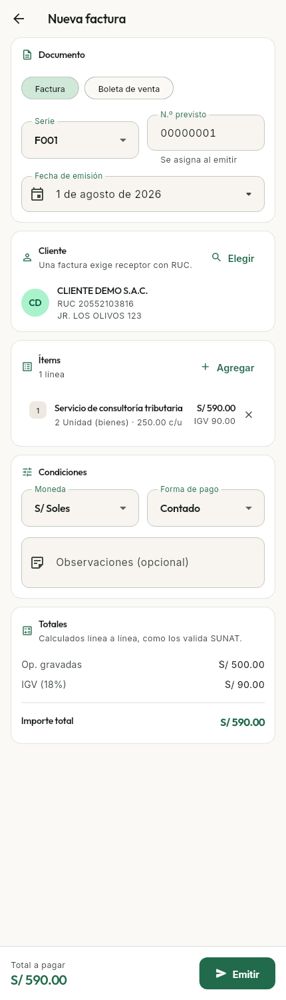
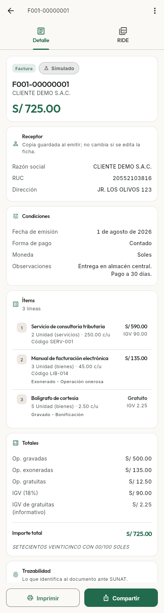
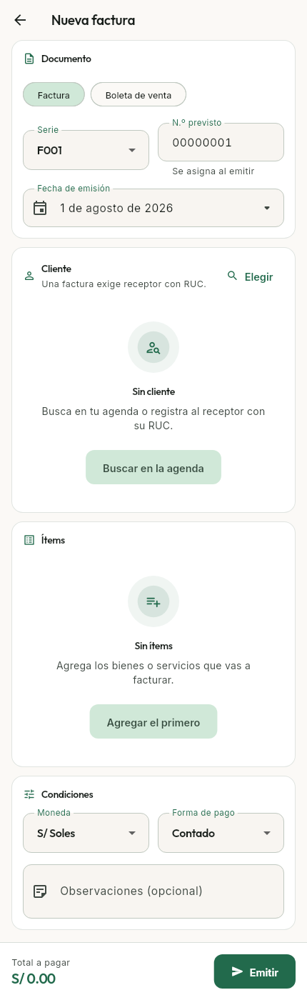
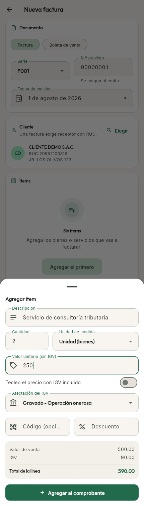
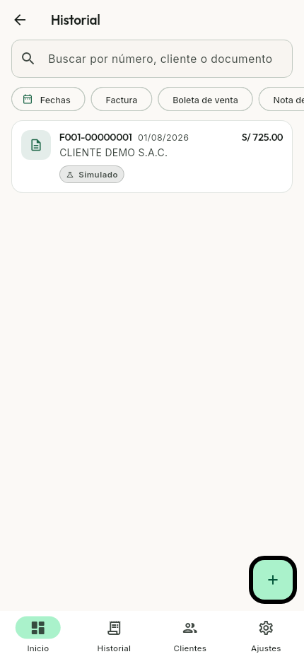
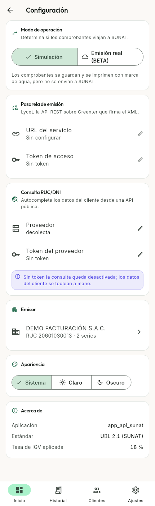
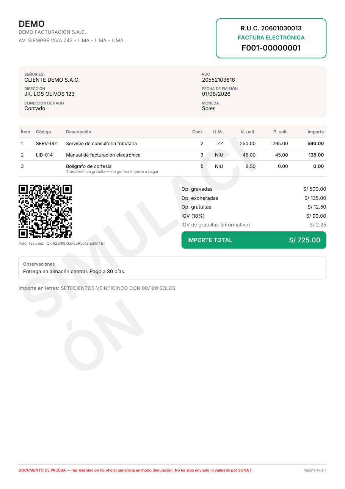

# app_api_sunat

App Flutter de **facturación electrónica para el mercado peruano**. Emite facturas y boletas
siguiendo el estándar UBL 2.1 de SUNAT, calcula el IGV con las reglas del Anexo VIII del
Reglamento de Comprobantes de Pago, y exporta cada documento como RIDE en PDF con su código QR.

Funciona **sin conexión y sin backend**: la base de datos, el motor de cálculo, el generador del
PDF y las tipografías viven en el dispositivo. La emisión real ante SUNAT es un añadido opcional,
no un requisito para usar la app.

<p align="center">
  
  
  
</p>

---

## Estado

El proyecto se construye en tres fases; cada una compila y corre antes de empezar la siguiente.

| Fase | Alcance | Estado |
| --- | --- | --- |
| 1 | MVP en modo Simulación: todo local, sin backend | **Completa** |
| 2 | Consulta RUC/DNI contra una API pública | Pendiente |
| 3 | Emisión real contra el ambiente BETA de SUNAT vía [Lycet](https://github.com/giansalex/lycet) | Pendiente |

Lo que ya se puede hacer hoy:

- Configurar el emisor en un onboarding de tres pasos (identificación, dirección fiscal, series).
- Llevar una agenda de clientes con validación de RUC (módulo 11) y DNI.
- Emitir facturas y boletas: ítems con unidad de medida, afectación del IGV, descuento por línea
  y captura del valor sin IGV **o** del precio al público, con los totales recalculándose en vivo.
- Consultar el historial con buscador y filtros por tipo, estado y rango de fechas.
- Ver el detalle de cualquier comprobante junto a su RIDE, e imprimirlo, compartirlo o guardarlo
  como PDF.
- Cambiar el modo de operación, las credenciales de la pasarela y el tema desde Configuración.

Lo que **todavía no** hace: consultar RUC/DNI en línea (Fase 2), enviar a SUNAT (Fase 3) y emitir
notas de crédito o débito —el dominio y el catálogo ya las contemplan, pero el formulario aún no
las ofrece—.

## Cómo se ve

La app tiene cuatro secciones con barra inferior, que en pantallas anchas se convierte en un riel
lateral: **Inicio** (resumen del día y del mes, tendencia de 14 días y últimos comprobantes),
**Historial**, **Clientes** y **Ajustes**.

| Emisión | Cálculo en vivo |
| --- | --- |
|  |  |
| La serie y el número previsto salen de lo declarado por la empresa; el correlativo definitivo se reserva al guardar. | La hoja de ítem muestra base, IGV y total de la línea según se teclea, con el mismo motor que después produce el RIDE. |
| **Historial** | **Configuración** |
|  |  |
| Buscador por número, cliente o documento, y filtros por tipo, estado y rango de fechas. | Modo de operación, credenciales de la pasarela (enmascaradas), tema y datos del emisor. |

### El RIDE

Cada comprobante se exporta como representación impresa en PDF, con el QR que exige SUNAT y las
tipografías incrustadas. En modo Simulación lleva marca de agua y una advertencia en el pie, para
que nadie lo confunda con un documento realmente emitido.

<p align="center">
  
</p>

El PDF de esa misma captura está en [`docs/capturas/ride.pdf`](docs/capturas/ride.pdf).

## Puesta en marcha

```bash
flutter pub get
dart run build_runner build
flutter run
```

La app arranca en **modo Simulación**: los comprobantes se guardan, se numeran y se imprimen, pero
no viajan a SUNAT. Es el modo por defecto y no necesita ninguna credencial.

Para trabajar contra una pasarela real, copia la plantilla de configuración y pásala al arrancar:

```bash
cp env.example.json env.json   # env.json está en .gitignore
flutter run --dart-define-from-file=env.json
```

Esos valores son sólo el punto de partida: se pueden sobrescribir desde Configuración, que los
guarda en la base local. **Ni tokens ni URLs se escriben nunca en el código.**

## Desarrollo

```bash
dart run build_runner build     # tras tocar entidades @freezed, providers @riverpod o tablas Drift
dart run build_runner watch     # regeneración continua
flutter analyze                 # debe terminar sin issues
flutter test                    # cálculo fiscal, formatos y recorridos de pantalla
```

Un solo caso por nombre:

```bash
flutter test test/calculadora_totales_test.dart --plain-name "IGV"
```

### Pruebas

```
test/
  calculadora_totales_test.dart        motor de cálculo fiscal, regla por regla
  formatos_test.dart                   importes y fechas en convención peruana
  pantalla_nuevo_comprobante_test.dart recorrido de emisión completo
  pantalla_detalle_comprobante_test.dart  detalle, RIDE y cadena del QR
  pantalla_configuracion_test.dart     ajustes y edición del emisor
  utiles/entorno_prueba.dart           andamiaje común
  capturas/generar_capturas.dart       genera docs/capturas (no entra en `flutter test`)
```

Las pruebas de pantalla montan la **app entera** —router, tema y providers incluidos— contra una
base de datos en memoria (`AppDatabase.paraPruebas`), no el widget suelto. Así cubren también el
cableado, que es donde se esconde lo que `flutter analyze` no ve: que emitir reserve el correlativo
sin repetirlo, que el receptor se copie dentro del comprobante, o que guardar dos ajustes seguidos
no pierda el segundo.

Para regenerar las capturas del README cuando cambie la interfaz:

```bash
flutter test --update-goldens test/capturas/generar_capturas.dart
python3 -c "import fitz; fitz.open('docs/capturas/ride.pdf')[0] \
  .get_pixmap(dpi=110).save('docs/capturas/8-ride.png')"   # requiere pymupdf
```

No forma parte de `flutter test` —el resultado depende de la máquina que renderiza— y por eso el
archivo no acaba en `_test.dart`.

## Arquitectura

Feature-first con capas. `lib/core/` es lo transversal; cada carpeta de `lib/features/<feature>/`
tiene `data/`, `domain/` y `presentation/`.

```
lib/
  core/
    constantes/    catálogos SUNAT (tipos de comprobante, afectación del IGV, unidades…)
    database/      esquema Drift, convertidores de enum y migraciones
    router/        rutas y go_router
    theme/         Material 3 con paleta propia, Espaciado y Radios
    utils/         formatos es-PE, redondeo monetario, número a letras, validadores
    widgets/       Seccion, EstadoVacio, EtiquetaEstado, esqueletos de carga
  features/
    empresa/       datos del emisor (registro único), onboarding y su edición
    clientes/      agenda de receptores
    comprobantes/  cálculo fiscal, persistencia, RIDE en PDF y emisión
    configuracion/ ajustes clave/valor (modo de operación, Lycet, tema)
    inicio/        dashboard y cáscara de navegación
```

Estado con **Riverpod 3** y generación de código; navegación con **go_router** (un `ShellRoute`
para las cuatro secciones, y un `redirect` que fuerza el onboarding mientras falte configurar la
empresa); persistencia con **Drift** sobre SQLite; PDF con **pdf** + **printing**.

### Qué pasa al emitir un comprobante

1. El formulario acumula el borrador en `borradorComprobanteProvider`, que es `autoDispose`: al
   salir de la pantalla se descarta y la siguiente emisión empieza limpia.
2. `Comprobante.validar()` devuelve la lista de problemas. Si no está vacía, no se guarda nada.
3. `ComprobanteRepositorio.crear` abre una transacción, **reserva el correlativo** y en la misma
   transacción inserta cabecera e ítems. Si algo falla, el número se devuelve con el rollback.
4. `ServicioEmision.emitir` intenta el envío sólo si hay pasarela configurada. En cualquier otro
   caso —o ante un fallo de red— devuelve un resultado en modo Simulación con un valor resumen
   calculado en local, suficiente para imprimir el RIDE y su QR.
5. La pantalla de detalle toma el relevo y muestra el estado resultante.

### Decisiones que sostienen el dominio

**El cálculo fiscal tiene una sola fuente de verdad.** `CalculadoraTotales` es una clase pura —sin
base de datos, sin red, sin estado— y `Comprobante.totales` es un getter que la invoca. Los totales
no se persisten (salvo `importeTotal`, denormalizado en la cabecera sólo para poder filtrar y sumar
en SQL), así que nunca pueden quedar desincronizados de los ítems.

**El IGV se calcula por línea sobre la base ya redondeada**, y después se suman las líneas. Es lo
que hace que el total cuadre con la validación de SUNAT, que admite una tolerancia de un céntimo.
Sumar primero y redondear después da un resultado distinto.

**Los enums de catálogo se persisten por su código SUNAT**, no por su índice: reordenar un `enum`
en Dart nunca puede corromper datos ya guardados.

**El comprobante guarda una copia del cliente, no una referencia.** Un documento emitido es un
registro histórico y no debe cambiar porque después se corrija la ficha del cliente.

**El correlativo se reserva dentro de la misma transacción en que se inserta el comprobante**, de
modo que no pueda repetirse ni saltarse un número.

**La emisión degrada con elegancia.** Si no hay pasarela configurada, si no responde o si el envío
lanza, el comprobante se conserva en modo Simulación. La app nunca pierde un documento ya capturado
por un fallo de red.

**Los importes en pantalla no usan los datos regionales de `intl`.** No existen para `es_PE` y la
librería degrada a los de España, que escriben `1.234,50 S/`. Perú usa `S/ 1,234.50`; ver
`core/utils/formatos.dart`.

## Sistema de diseño

Material 3 con semilla esmeralda (`#0E9F6E`), acento índigo y neutros cálidos —los `surface*` se
sobrescriben a mano porque `ColorScheme.fromSeed` los derivaría fríos—. Los espaciados salen de
`Espaciado` (múltiplos de 8) y los radios de `Radios`; no se usan números sueltos. Los estados
vacíos usan `EstadoVacio` y las cargas, los esqueletos de `core/widgets/esqueletos.dart`, no
spinners centrados.

Outfit para títulos, Inter para texto: van empaquetadas en `assets/fonts/` en lugar de descargarse,
porque la app debe verse igual sin conexión y el generador de PDF necesita el TTF para incrustarlo
en el RIDE.

## Idioma del código

Todo el código se escribe en español (es-PE): clases, métodos, variables, comentarios y copy de la
interfaz. Sólo quedan en inglés los identificadores que imponen los paquetes externos (`build`,
`copyWith`, `fromSql`…). Los comentarios explican **por qué**, no qué hace la línea.

## Referencias

- [`docs/ejemplo_ubl_boleta.xml`](docs/ejemplo_ubl_boleta.xml) — XML real de una boleta firmada,
  referencia de estructura para el envío de la Fase 3.
- [`docs/capturas/ride.pdf`](docs/capturas/ride.pdf) — RIDE de ejemplo generado por la app.
- [`CLAUDE.md`](CLAUDE.md) — notas de arquitectura, trampas de compilación e invariantes del
  dominio, para quien vaya a tocar el código.
- [Lycet](https://github.com/giansalex/lycet) — API REST sobre Greenter; la firma XML-DSig y el
  cliente SOAP no se reimplementan en Dart.
